# 🏆 이정무 — 수상·활동 포트폴리오

> 생성일시: 2026. 5. 25. 오후 2:50:47 &nbsp;|&nbsp; 오선중학교 3학년 5반

---

## 📊 요약

| 구분 | 건수 |
|------|------|
| 🏆 대회 수상 | 13건 |
| 📜 수료·이수 | 2건 |
| 📋 임명장 | 3건 |
| 📅 활동 기간 | 2021 ~ 2026 |

---

## 📅 타임라인

### 2021.12.13 — 제11회 부산로봇경진대회 — 해거톤 1위

| 항목 | 내용 |
|------|------|
| 구분 | 🏆 수상 |
| 등위/구분 | 해거톤 1위 |
| 수여 주최 | 부산광역시장 |
| 소속 | 명원초등학교 4학년 |
| 참여 인원 | 이정무, 강무진, 배소은 |
| 증빙 이미지 파일 | ./images/item_01.jpg |

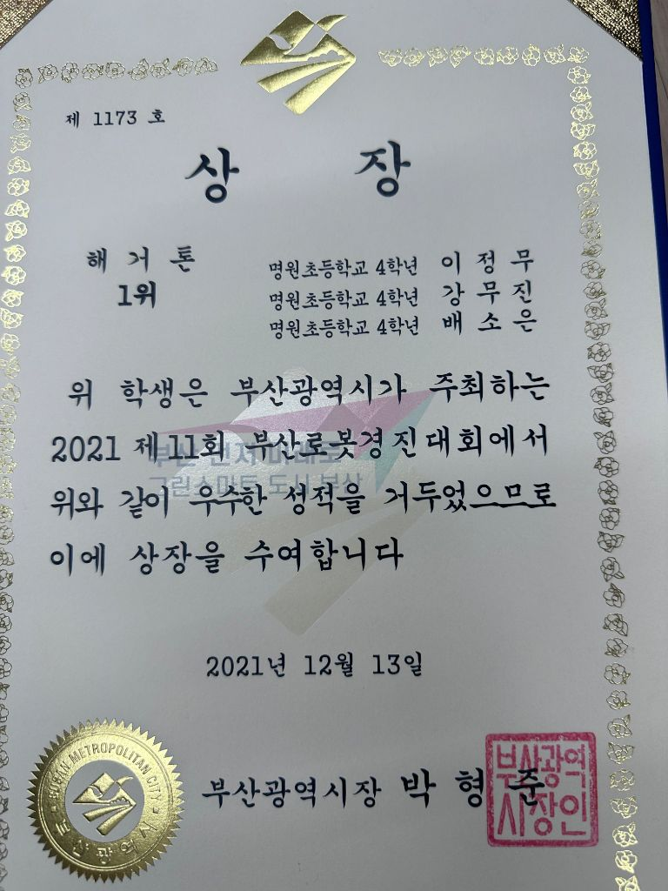

**✏️ 나의 역할 / 배운 점**

2021년도에는 전 세계적으로 코로나라는 재해가 닥친 시기였습니다. 그래서 저희는 스마트 마스크를 마이크로비트로 구현해보았습니다. 마이크로비트 메이크코드 파이썬으로 프로그래밍을 하였습니다. 스마트 마스크는 마스크에 온도센서가 달려있어 사용자의 체온이 일정 온도 이상이 되면 경고를 하고 영화관 등의 공공시설의 출입을 제한하도록 하는 등의 기능이 있습니다. 저는 이 대회에서 프로그래밍, 제작, 발표자료 제작을 담당했습니다. 대회를 통해 가장 먼저 팀워크의 중요성을 깨달았고 실제로 다양한 의견을 조율하며 문제를 해결해가는 과정이 중요했습니다. 또한 실무경험을 통해 기술을 습득하고 제한된 시간내에 프로젝트를 완성해야 했어서 시간관리의 중요성을 느꼈습니다.

---

### 2022.10.23 — 제12회 부산로봇경진대회 — 로봇방탈출 3위

| 항목 | 내용 |
|------|------|
| 구분 | 🏆 수상 |
| 등위/구분 | 로봇방탈출 3위 |
| 수여 주최 | 부산광역시교육감|
| 소속 | 명원초등학교 5학년 |
| 참여 인원 | 이정무, 강무진 |
| 증빙 이미지 파일 | ./images/item_02.jpg |

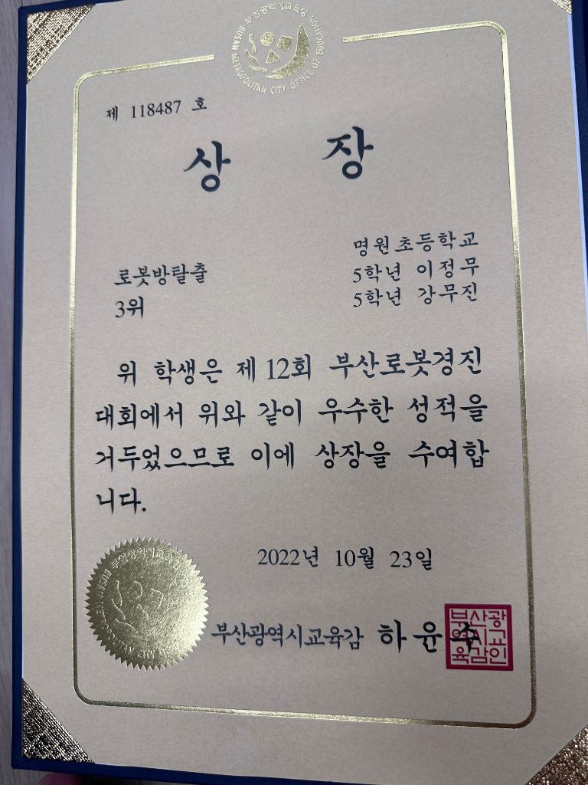

**✏️ 나의 역할 / 배운 점**

로봇방탈출 대회는 두 팀이 한 조로 미로 안에서 가장 먼저 네오봇을 탈출시키는 부문입니다. 이 대회에서 저는 엔트리로 프로그래밍을 하였고 로봇 제작을 담당했습니다. 이 대회에서는 로봇을 직접 조종할 수 없으므로 보통 다른 팀들은 센서를 이용해 자율주행을 했는데 저희 팀은 다른 팀과는 다르게 미로 한 칸당 네오봇이 이동하는 거리를 측정해 주행거리와 속도를 계산하였습니다. 이 대회에서 가장 뼈저리게 느낀점은 상대 팀보다 먼저 미로를 탈출해야한다는 극심한 압박감 속에서도 유지해야하는 평정심이였고 주행거리를 계산할때 1초의 오차가 치명적 실수로 이어질 수 있어 정확한 계산능력이 중요하다는 점을 느꼈습니다.

---

### 2022.10.23 — 제12회 부산로봇경진대회 — 해커톤 2위

| 항목 | 내용 |
|------|------|
| 구분 | 💻 해커톤 |
| 등위/구분 | 해커톤 2위 |
| 수여 주최 | 부산광역시교육감|
| 소속 | 명원초등학교 5학년 |
| 참여 인원 | 이정무, 강무진, 오예준 |
| 증빙 이미지 파일 | ./images/item_03.jpg |

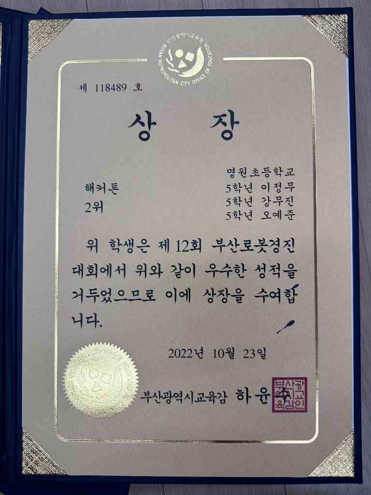

**✏️ 나의 역할 / 배운 점**

2022년 여름에 태풍 힌남노가 전국을 강타하였습니다. 이에 따른 인명피해와 재산피해의 규모는 거대했습니다. 저희는 태풍 힌남노의 위력과 위험성을 직접 느껴서 어떻게하면 우리 힘으로 이와같은 자연재해를 해결 할 수 있을지 고민했습니다. 그래서 저희는 지하차도와 지하주차장 침수로 인한 사망사고를 바탕으로 마이크로비트를 활용해 파이썬으로 일정 수위가 감지되면 지하주차장과 지하차도에 차수판 차수벽을 설치하는 시스템을 구상해보았습니다. 이를 통해 다시한번 더 팀워크의 중요성을 깨달았고 어떻게 하면 안타까운 일로 사망사고를 막을 수 있을까 라고 고민하는 과정에서 생명의 소중함을 느꼈습니다.

---

### 2023.03.20 — 교내 발명아이디어 대회 — 장려상

| 항목 | 내용 |
|------|------|
| 구분 | 🏆 수상 |
| 등위/구분 | 장려상 |
| 수여 주최 | 명원초등학교장|
| 소속 | 명원초등학교 6학년 9반 |
| 참여 인원 | 이정무 |
| 증빙 이미지 파일 | ./images/item_04.jpg |

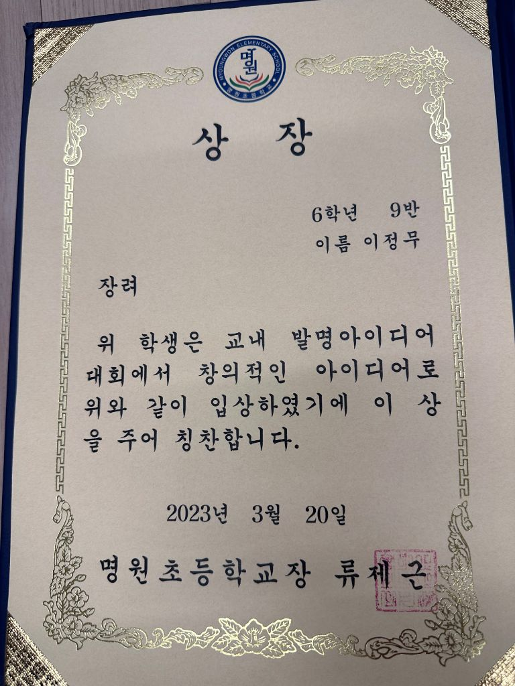

**✏️ 나의 역할 / 배운 점**

제가 이번 발명 아이디어 대회에서 선보인 아이디어는 '스마트 우산 손잡이로, 기존 우산에 탈부착이 가능한 손잡이에 그날의 강수 확률에 따라 색이 변하는 LED 알림, 블루투스로 스마트폰과 연결되는 분실 방지 기능, 우산을 펼치고 접는 운동에너지로 작동하는 자가 발전 기능을 담은 발명품입니다. 이번 대회를 준비하며 저는 "가장 위대한 발명은 멀리 있는 것이 아니라 일상의 작은 불편함 속에 숨어 있다" 는 사실과 함께, 혼자 고민하기보다 피드백을 주고받으며 아이디어를 발전시키는 협업의 가치, 그리고 완벽한 첫 시도보다 꾸준한 개선이 더 중요하다는 교훈을 얻을 수 있었습니다.

---

### 2023.06.19 — 2023학년도 전교학생회 회장 임명

| 항목 | 내용 |
|------|------|
| 구분 | 📋 임명 |
| 등위/구분 | 전교 회장 |
| 수여 주최 | 명문초등학교장|
| 소속 | 명문초등학교 6학년 1반 |
| 참여 인원 | 이정무 |
| 증빙 이미지 파일 | ./images/item_05.jpg |

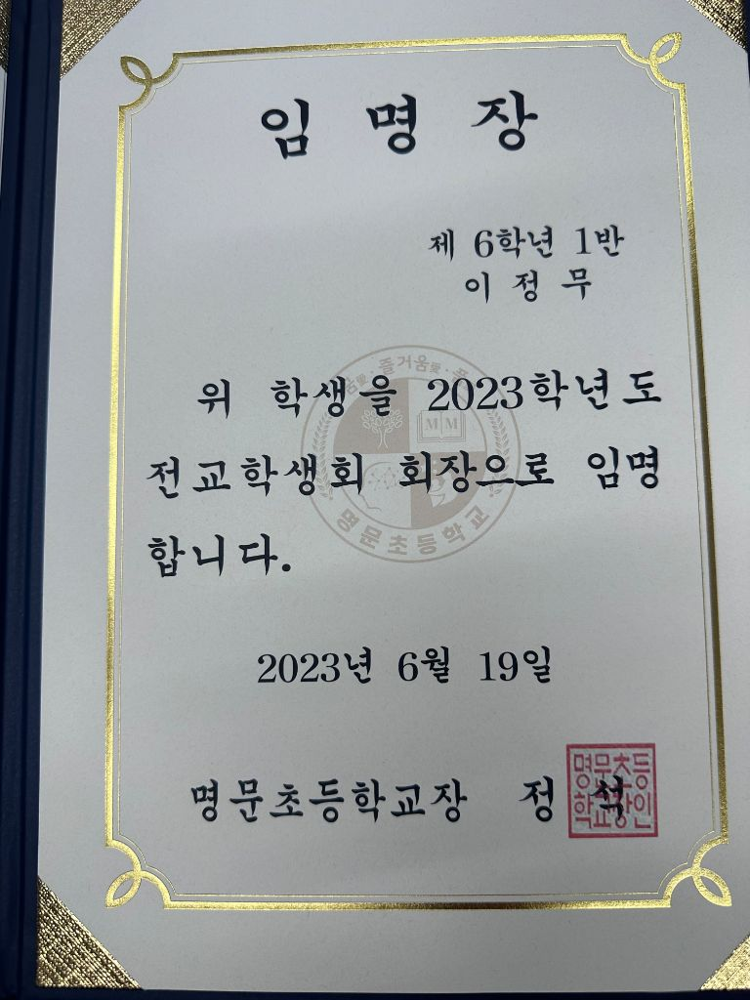

**✏️ 나의 역할 / 배운 점**

학생회장으로 활동하면서 저는 단순히 직책을 맡는 것을 넘어, 학생들의 작은 목소리에 귀 기울이고 이를 실제 변화로 만들어내는 과정의 가치를 깊이 깨달았습니다. 등교 시간에 학생들로부터 신청곡을 받아 음악을 틀어주는 활동을 진행하면서, 매일 아침 친구들이 자신이 신청한 노래를 들으며 환하게 웃는 모습을 볼 때마다 사소해 보이는 일상의 변화가 학교 분위기 전체를 바꿀 수 있다는 사실을 실감했습니다. 또한 신청곡을 통해 평소 대화가 없던 친구들의 음악 취향을 알게 되면서, 리더란 앞에서 이끄는 사람이 아니라 모두의 이야기를 들어주는 사람이라는 것을 배웠습니다. 특히 학교 종소리를 양방언 작곡가님의 곡으로 바꾸기 위해 직접 이메일을 보내 저작권 허락을 받았던 경험은 저에게 가장 큰 성장의 순간이었습니다. 처음 이메일을 보낼 때는 '과연 답장이 올까?', '학생이 보낸 메일을 진지하게 봐주실까?' 하는 두려움이 컸지만, 정중하게 취지를 설명드린 끝에 흔쾌히 허락을 받아냈을 때 "두드리지 않으면 절대 열리지 않는 문이 있다" 는 사실을 온몸으로 느꼈습니다. 이 경험을 통해 저는 무언가를 바꾸고 싶다면 불평하기보다 먼저 행동하고, 정식 절차를 거쳐 정당하게 요청하는 용기가 필요하다는 것을 배웠고, 저작권이라는 어른들의 세계에서도 학생의 진심이 통할 수 있다는 자신감을 얻었습니다. 마지막으로 학생들을 대상으로 급식 선호도 조사를 실시하고 그 결과를 실제 급식 메뉴에 반영했던 활동은 "공약은 외치는 것이 아니라 실행하는 것" 이라는 교훈을 남겼습니다. 설문지를 만들고, 통계를 내고, 영양 선생님과 조리사 선생님들을 직접 찾아뵙고 협조를 구하는 과정은 결코 쉽지 않았지만, 학생들이 원하는 메뉴가 식판에 올라오는 날 친구들이 "회장 덕분에 오늘 급식 맛있다"라고 말해줄 때의 보람은 그 어떤 상보다 값졌습니다. 이 모든 활동을 통해 저는 리더십이란 권한을 행사하는 것이 아니라, 구성원들의 의견을 모아 작은 변화라도 꾸준히 만들어내는 책임감이라는 것을 깨달았고, 앞으로 어떤 자리에 있든 '듣고, 행동하고, 책임지는 사람' 이 되겠다는 다짐을 하게 되었습니다.

---

### 2023.09.03 — 제13회 부산로봇경진대회 — 로봇방탈출 수상

| 항목 | 내용 |
|------|------|
| 구분 | 🏆 수상 |
| 등위/구분 | 로봇방탈출 |
| 수여 주최 | 한국로봇융합연구원장 |
| 소속 | 명문초등학교 |
| 참여 인원 | 강무진, 이정무 |
| 증빙 이미지 파일 | ./images/item_06.jpg |

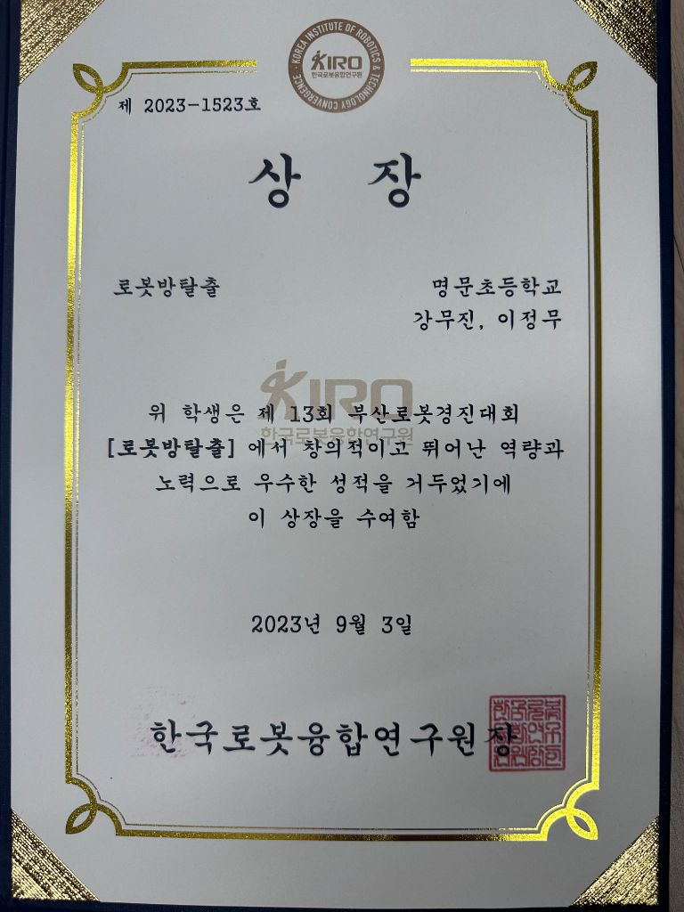

**✏️ 나의 역할 / 배운 점**

저는 이번 대회에서 로봇 하드웨어 제작과 소프트웨어 프로그래밍을 동시에 담당했습니다. 로봇의 작동 원리와 제어 로직을 직접 설계하고 구현했습니다. 이번 대회에서는 하드웨어와 소프트웨어를 함께 다루는 과정에서 두 요소가 긴밀하게 연동되어야 한다는 시스템 통합의 중요성을 깨달았습니다. 또한 계산실수를 빠르게 디버깅하면서 문제 해결 능려고가 압박 상황에서의 집중력이 중요하다는 것을 다시 한번 더 느꼈습니다. 그리고 효율적인 작업을 위해 팀원 간 소통도 중요했습니다.

---

### 2023.09.03 — 제13회 부산로봇경진대회 — 초등해커톤 금상

| 항목 | 내용 |
|------|------|
| 구분 | 💻 해커톤 |
| 등위/구분 | 금상 |
| 수여 주최 | 부산광역시장|
| 소속 | 명문초등학교 6학년 |
| 참여 인원 | 이정무 |
| 증빙 이미지 파일 | ./images/item_07.jpg |

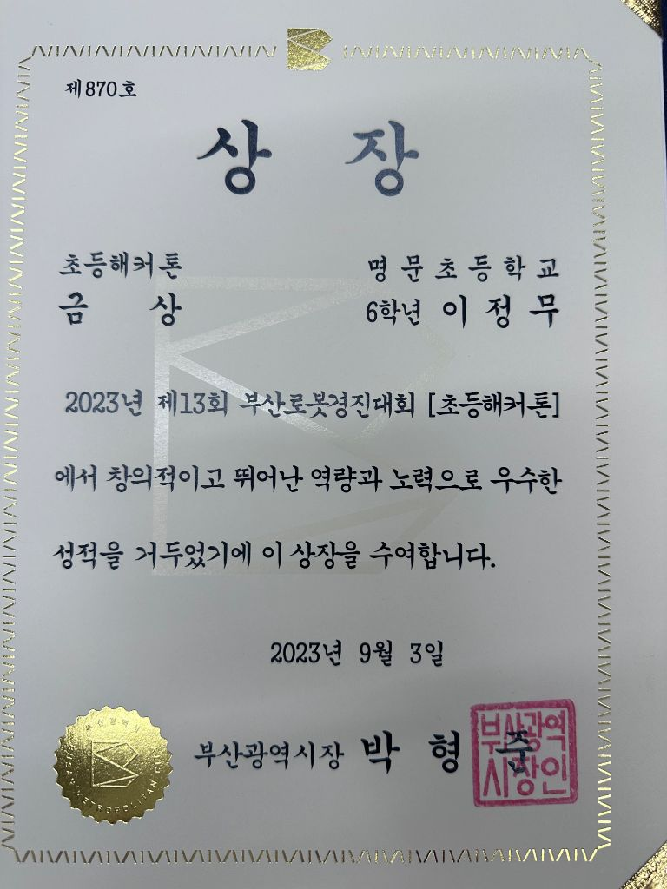

**✏️ 나의 역할 / 배운 점**

2023년에는 화재로 인한 피해가 막대하였습니다. 그래서 저희는 AIOT기반 산불 진화 시스템을 구현하였습니다. 산불 진화 시스템은 산 곳곳에 작은 온도센서들을 설치하여 일정 온도 이상이 감지되면 드론과 등산로 기둥에 설치된 스프링쿨러가 작동하여 산불을 초기에 감지, 진화 할 수 있는 시스템 입니다. 프로젝트 발표를 준비하는 과정에 있어 팀원 간의 작은 갈등이 있었으나 대화와 배려, 타협을 통해 오히려 팀원과의 관계를 돈독히 할 수 있었습니다. 이번 프로젝트에서 역시 팀장으로서 프로그레밍과 제작, 발표를 당담했습니다.

---

### 2024.02.08 — 교내 탐구상

| 항목 | 내용 |
|------|------|
| 구분 | 🏆 수상 |
| 등위/구분 | 탐구상 |
| 수여 주최 | 명문초등학교장|
| 소속 | 명문초등학교 6학년 1반 |
| 참여 인원 | 이정무 |
| 증빙 이미지 파일 | ./images/item_09.jpg |

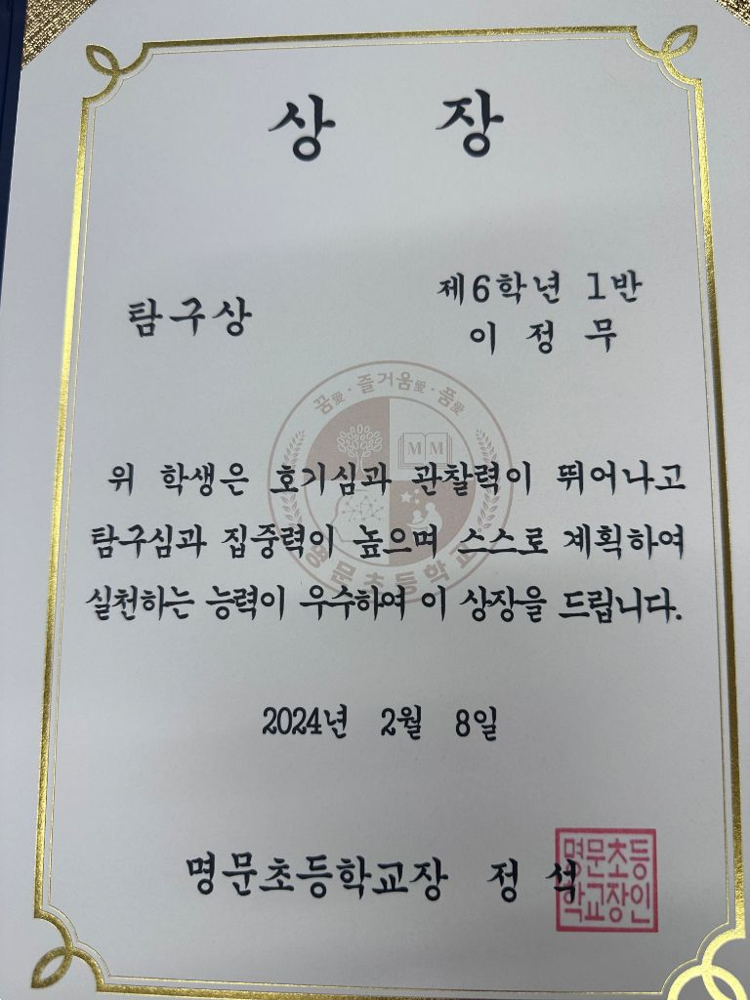

**✏️ 나의 역할 / 배운 점**

이 스마트 주택은 집 전체가 태양의 이동 경로를 따라 자동으로 회전하는 구조를 핵심 원리로 설계하였습니다. 거실처럼 채광이 필요한 공간은 항상 태양을 향하게 하여 밝고 따뜻하게 유지하고, 창고와 화장실처럼 서늘한 환경이 필요한 공간은 태양 반대편에 배치하여 공간별 최적의 온도 환경을 자동으로 조성하였습니다. 온도와 습도 센서를 활용하여 실내 환경이 기준치를 벗어나면 창문이 자동으로 열리고 닫히는 시스템을 구현하였습니다. 태양광 패널을 회전 구조와 연동하여 하루 중 어느 시간대에도 햇빛을 정면으로 받을 수 있도록 함으로써 에너지 생산 효율을 극대화하였습니다. 이번 탐구를 통해 자연 현상을 설계 원리로 활용하여 에너지 효율과 생활 편의를 동시에 실현할 수 있다는 것을 직접 체감하였습니다. 기계 구조, 센서 제어, 에너지 시스템이 하나로 연동될 때 비로소 완성된 스마트 주택이 된다는 사실을 깨달으며 미래 친환경 주거에 대한 가능성을 확인할 수 있었습니다.

---

### 2024.02.08 — 전교 어린이회 학생회장 — 공로상

| 항목 | 내용 |
|------|------|
| 구분 | 🏆 수상 |
| 등위/구분 | 공로상 |
| 수여 주최 | 명문초등학교장|
| 소속 | 명문초등학교 6학년 1반 |
| 참여 인원 | 이정무 |
| 증빙 이미지 파일 | ./images/item_10.jpg |

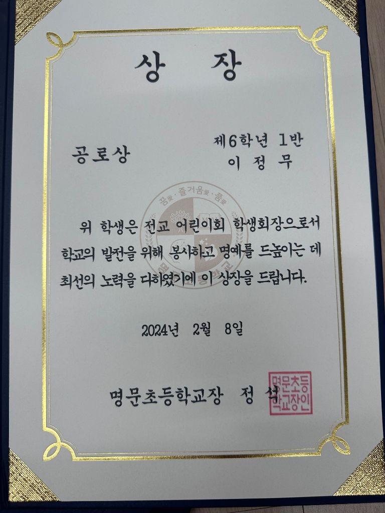

**✏️ 나의 역할 / 배운 점**

학생회장으로서 첫 공약은 학교 종소리가 너무 단조로워 양방언 작곡가님께 직접 이메일로 저작권 허락을 구해 종소리를 퓨전국악으로 바꾸었습니다. 이 과정에서 목표를 위해 적극적으로 행동하는 것의 중요성을 깨달았습니다. 그리고 급식 선호도 조사를 실제 메뉴에 반영하고 등교 시간 신청곡 서비스를 운영하며 학생들의 의견이 학교생활에 직접 반영될 수 있다는 학생 자치의 가능성을 확인하였습니다. 학생회를 이끌면서 리더십이란 혼자 앞서가는 것이 아니라 구성원의 목소리에 귀 기울이고 함께 실행해 나가는 과정임을 배웠습니다. 모든 공약을 직접 실천하며 학교 분위기를 긍정적으로 변화시켰다는 성취감과 함께, 작은 아이디어도 실천 의지만 있다면 실제 변화로 이어질 수 있다는 값진 교훈을 얻었습니다.

---

### 2024.04.09 — 2024학년도 학급 반장 임명

| 항목 | 내용 |
|------|------|
| 구분 | 📋 임명 |
| 등위/구분 | 반장 |
| 수여 주최 | 오선중학교장|
| 소속 | 오선중학교 1학년 8반 |
| 참여 인원 | 이정무 |
| 증빙 이미지 파일 | ./images/item_11.jpg |

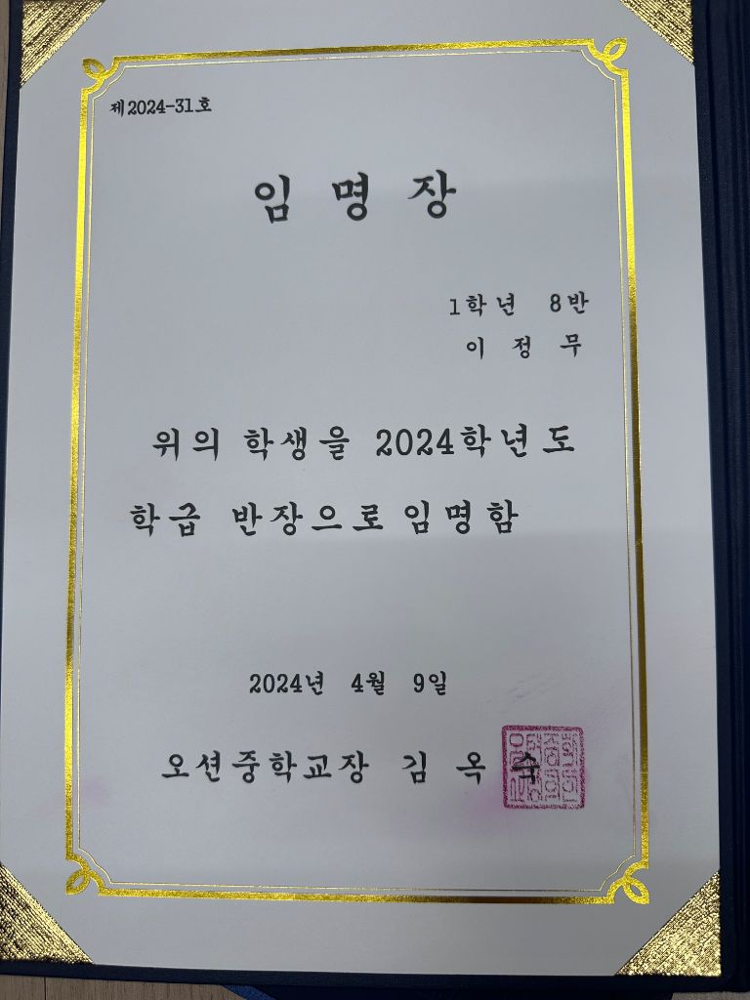

**✏️ 나의 역할 / 배운 점**

반장을 하면서 배운점은 규칙을 강요하기보다 내가 먼저 실천했을 때 친구들이 자연스럽게 따라온다는 것을 배웠습니다. 불편한 상황도 외면하지 않고 조율했을 때 반 전체의 신뢰가 높아졌습니다. 잘하는 친구만이 아니라 뒤처지거나 소외된 친구를 포함시키는 것이 진짜 통합임을 깨달았습니다. 그리고 학습분위기 형성에 힘을 보태어 학년 평균 성적 1등반을 이루어 냈습니다.

---

### 2024.07.31 — 2024 SW·AI융합 해카톤 대회 — 장려상

| 항목 | 내용 |
|------|------|
| 구분 | 💻 해커톤 |
| 등위/구분 | 장려상 |
| 수여 주최 | 부산광역시교육청교육연구정보원장|
| 소속 | 오선중학교 1학년 |
| 참여 인원 | 김시원, 강무진, 이정무, 최재훈 |
| 증빙 이미지 파일 | ./images/item_12.jpg |

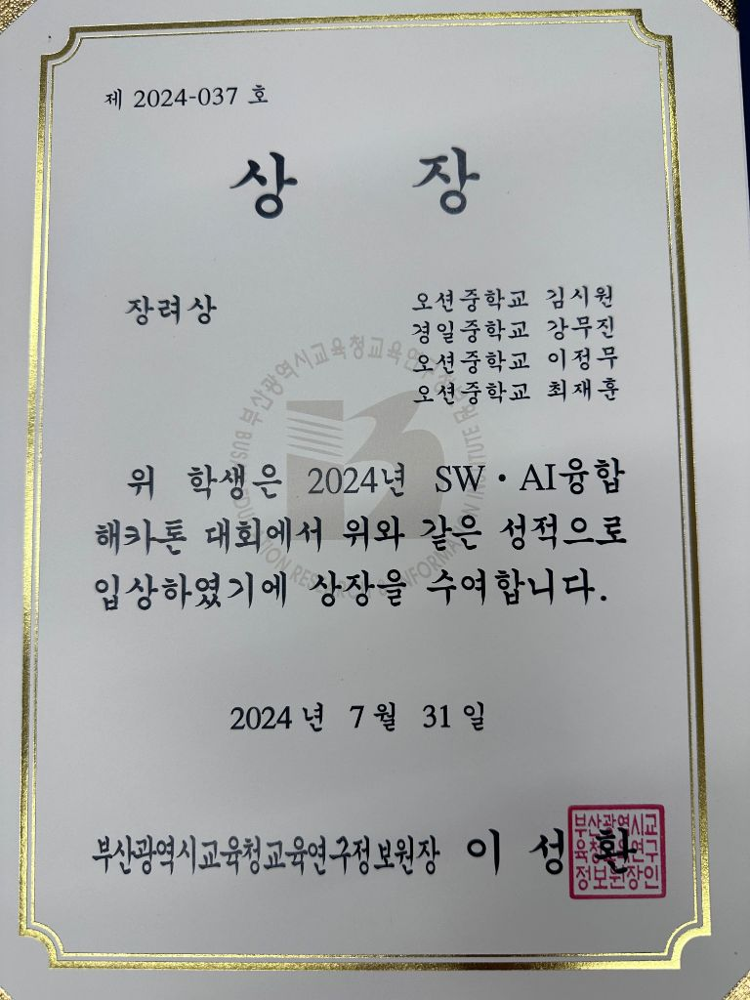

**✏️ 나의 역할 / 배운 점**

해커톤 대회에서 교통사고 문제를 해결하기 위해 횡단보도 보호 벽 시스템, 불법주정차 자동신고 프로그램, 황색 신호 시 자동 감속 프로그램을 직접 설계하고 구현하는 핵심 개발 역할을 담당하였습니다. 실제 사회 문제인 교통사고 데이터를 분석하여 이를 기술로 해결하는 아이디어를 구체화하고 작동 가능한 시스템으로 완성함으로써 팀의 결과물 전반에 걸쳐 결정적인 기여를 하였습니다. 현실의 문제를 단순한 아이디어에 그치지 않고 카메라 인식, 자동 제어, 물리적 차단 시스템으로 구현하는 과정에서 기술이 사람의 생명과 안전을 지키는 데 실질적으로 활용될 수 있다는 것을 깊이 깨달았습니다.

---

### 2024.10.16 — 2024 정보행사 로봇 축구대회 — 최우수 1위

| 항목 | 내용 |
|------|------|
| 구분 | 🏆 수상 |
| 등위/구분 | 최우수 1위 |
| 수여 주최 | 오선중학교장|
| 소속 | 오선중학교 1학년 8반 |
| 참여 인원 | 이정무 |
| 증빙 이미지 파일 | ./images/item_13.jpg |

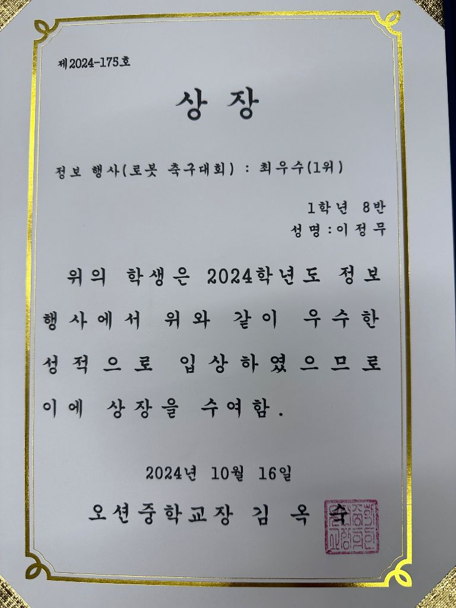

**✏️ 나의 역할 / 배운 점**

단순히 빠르고 강한 로봇이 이기는 게 아니라 공을 구석으로 몰아 벽을 활용하는 구조적 전략이 상대의 대응 자체를 차단한다는 것을 배웠습니다. 공을 구석으로 모는 역할과 드리블로 마무리하는 역할이 서로 맞물려야 전략이 실제로 작동한다는 것을 경험하며, 팀워크 없이는 아무리 좋은 전략도 실패한다는 것을 깨달았습니다.

---

### 2024.12.21 — 부산광역시교육청 정보영재교육원 수료 (중1기초공통3반)

| 항목 | 내용 |
|------|------|
| 구분 | 📜 수료/이수 |
| 등위/구분 | 수료 |
| 수여 주최 | 부산광역시교육청정보영재교육원장 |
| 소속 | 오선중학교 1학년 |
| 기간 | 2024.03.16~2025.02.28 |
| 증빙 이미지 파일 | ./images/item_14.jpg |

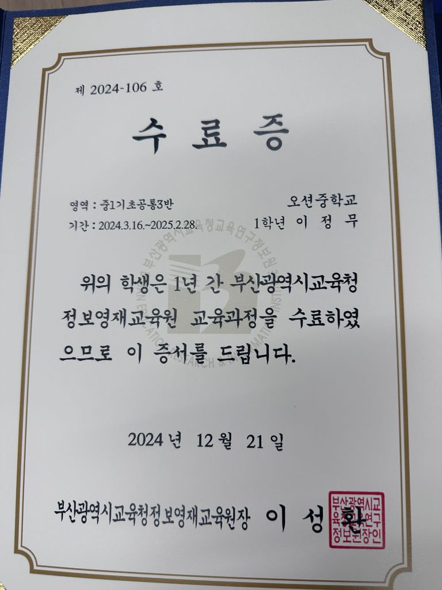

**✏️ 나의 역할 / 배운 점**

파이썬을 활용한 코딩 학습을 통해 단순히 코드를 작성하는 것을 넘어 문제를 논리적으로 분해하고 구조화하는 사고방식을 기를 수 있었습니다. 프로젝트 발표 과정에서 내가 구현한 내용을 타인에게 명확하게 설달하는 것이 개발만큼이나 중요한 역량임을 깨달았습니다. 영재원 수료를 통해 비슷한 관심사를 가진 친구들과 함께 성장하며, 정보 분야에 대한 열정과 더 깊이 탐구하고 싶다는 동기를 얻었습니다.

---

### 2025.05.22 — 2025 오선 과학-환경행사 아이디어 — 장려(3위)

| 항목 | 내용 |
|------|------|
| 구분 | 🏆 수상 |
| 등위/구분 | 장려 3위 |
| 수여 주최 | 오선중학교장|
| 소속 | 오선중학교 2학년 7반 |
| 참여 인원 | 이정무 |
| 증빙 이미지 파일 | ./images/item_15.jpg |

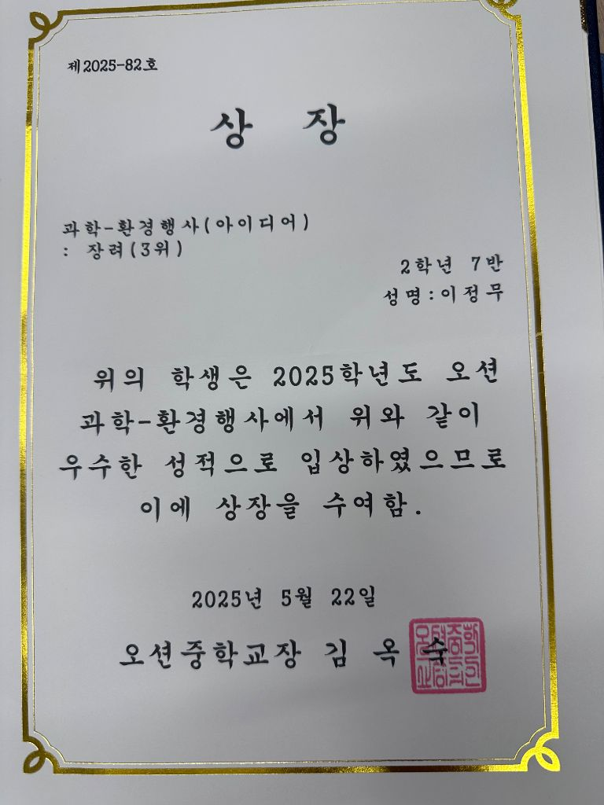

**✏️ 나의 역할 / 배운 점**

전통 한옥의 구조와 미적 요소를 그대로 살리면서 스마트 기술을 접목하는 아이디어를 구현하며, 전통과 현대 기술이 대립하는 것이 아니라 서로를 보완할 수 있다는 것을 배웠습니다. 온도 조절, 자동 채광 등 한옥의 자연친화적 특성을 스마트 센서와 연결하는 설계 과정에서 기술은 편의를 위한 수단이 아니라 삶의 질을 높이는 도구임을 깨달았습니다. 단순한 아이디어를 실제 작동하는 결과물로 구현하는 경험을 통해, 창의적 발상을 현실로 만드는 데는 끈기 있는 설계와 반복적인 수정이 필수적임을 실감했습니다.

---

### 2025.12.20 — 부산광역시교육청 정보영재교육원 이수 (중2로봇창작1반)

| 항목 | 내용 |
|------|------|
| 구분 | 📜 수료/이수 |
| 등위/구분 | 이수 |
| 수여 주최 | 부산광역시교육청정보영재교육원장|
| 소속 | 오선중학교 2학년 |
| 기간 | 2025.03.22~2026.02.28 |
| 증빙 이미지 파일 | ./images/item_16.jpg |

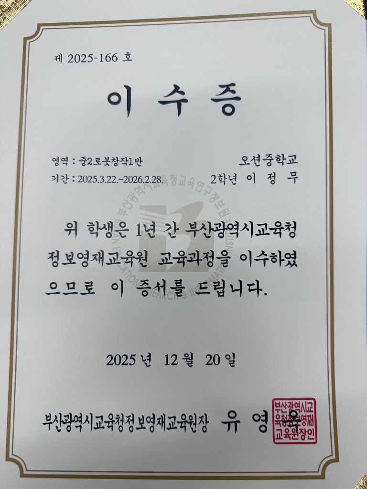

**✏️ 나의 역할 / 배운 점**

C언어를 통해 메모리 구조와 논리적 흐름을 직접 다루며 프로그래밍의 기초 원리를 깊이 이해할 수 있었고, 아두이노를 활용한 실습에서는 코드가 실제 하드웨어를 제어하는 순간을 경험하며 소프트웨어와 물리적 세계가 연결되는 컴퓨팅의 본질을 체감했습니다. 단순히 화면 속 결과물이 아닌 직접 작동하는 장치를 만드는 과정에서, 이론과 실제를 통합하는 융합적 사고력과 문제 해결 능력을 기를 수 있었습니다.

---

### 2026.04.14 — 2026학년도 학급 반장 임명

| 항목 | 내용 |
|------|------|
| 구분 | 📋 임명 |
| 등위/구분 | 반장 |
| 수여 주최 | 오선중학교장 |
| 소속 | 오선중학교 3학년 5반 |
| 참여 인원 | 이정무 |
| 증빙 이미지 파일 | ./images/item_17.jpg |

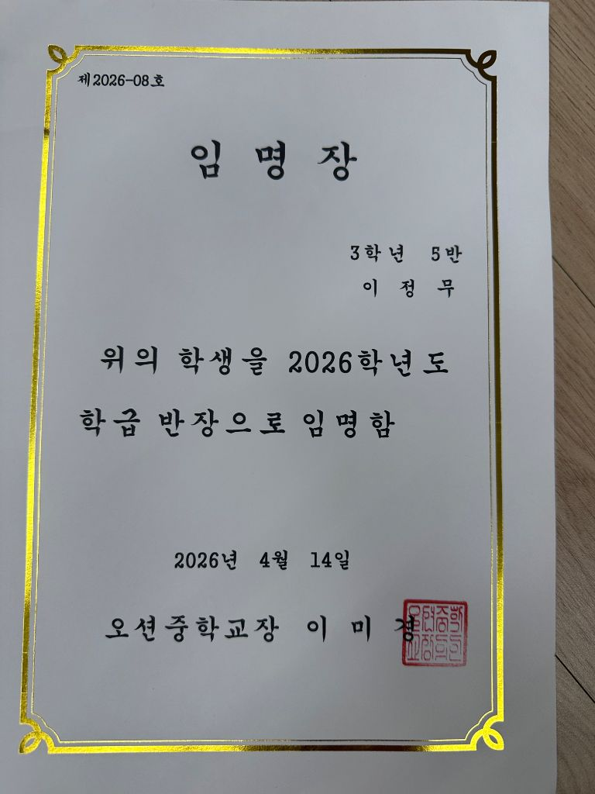

**✏️ 나의 역할 / 배운 점**

반장으로서 체육대회 준비 과정에서 친구들의 의견을 조율하고 연습 일정을 조직하며, 리더십이란 앞에서 이끄는 것이 아니라 모두가 하나의 목표를 향해 움직일 수 있도록 환경을 만드는 것임을 배웠습니다. 반 대항전 1등이라는 결과는 개인의 실력이 아닌 반 전체가 서로를 믿고 맞춰온 협동의 산물임을 몸소 느끼며, 공동체의 힘이 개인의 능력을 훨씬 뛰어넘을 수 있다는 것을 깨달았습니다. 앞으로도 맡은 역할에 책임감을 갖고, 구성원 모두가 최선을 발휘할 수 있는 분위기를 만드는 리더로 성장하겠다는 다짐을 갖게 되었습니다.

---
